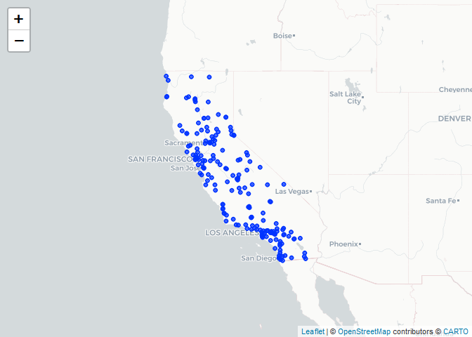

Assignment 01 - Exploratory Data Analysis
================
Camille Parchment
2022-09-20

Step 1. \##Read in the data

``` r
library(data.table)
library(tidyverse)
```

    ## ── Attaching packages ─────────────────────────────────────── tidyverse 1.3.2 ──
    ## ✔ ggplot2 3.3.6     ✔ purrr   0.3.4
    ## ✔ tibble  3.1.8     ✔ dplyr   1.0.9
    ## ✔ tidyr   1.2.0     ✔ stringr 1.4.1
    ## ✔ readr   2.1.2     ✔ forcats 0.5.2
    ## ── Conflicts ────────────────────────────────────────── tidyverse_conflicts() ──
    ## ✖ dplyr::between()   masks data.table::between()
    ## ✖ dplyr::filter()    masks stats::filter()
    ## ✖ dplyr::first()     masks data.table::first()
    ## ✖ dplyr::lag()       masks stats::lag()
    ## ✖ dplyr::last()      masks data.table::last()
    ## ✖ purrr::transpose() masks data.table::transpose()

``` r
epadf <- ("EPA_04.csv")
```

``` r
class(epadf)
```

    ## [1] "character"

``` r
epa19 <- fread("EPA_19.csv", header = TRUE, )
```

Checking head, tail,dimensions and summary for 2019 data.

``` r
summary(epa19)
```

    ##      Date              Source             Site ID              POC        
    ##  Length:53156       Length:53156       Min.   :60010007   Min.   : 1.000  
    ##  Class :character   Class :character   1st Qu.:60310004   1st Qu.: 1.000  
    ##  Mode  :character   Mode  :character   Median :60612003   Median : 3.000  
    ##                                        Mean   :60565264   Mean   : 2.573  
    ##                                        3rd Qu.:60771002   3rd Qu.: 3.000  
    ##                                        Max.   :61131003   Max.   :21.000  
    ##                                                                           
    ##  Daily Mean PM2.5 Concentration    UNITS           DAILY_AQI_VALUE 
    ##  Min.   : -2.20                 Length:53156       Min.   :  0.00  
    ##  1st Qu.:  4.00                 Class :character   1st Qu.: 17.00  
    ##  Median :  6.50                 Mode  :character   Median : 27.00  
    ##  Mean   :  7.74                                    Mean   : 30.58  
    ##  3rd Qu.:  9.90                                    3rd Qu.: 41.00  
    ##  Max.   :120.90                                    Max.   :185.00  
    ##                                                                    
    ##   Site Name         DAILY_OBS_COUNT PERCENT_COMPLETE AQS_PARAMETER_CODE
    ##  Length:53156       Min.   :1       Min.   :100      Min.   :88101     
    ##  Class :character   1st Qu.:1       1st Qu.:100      1st Qu.:88101     
    ##  Mode  :character   Median :1       Median :100      Median :88101     
    ##                     Mean   :1       Mean   :100      Mean   :88214     
    ##                     3rd Qu.:1       3rd Qu.:100      3rd Qu.:88502     
    ##                     Max.   :1       Max.   :100      Max.   :88502     
    ##                                                                        
    ##  AQS_PARAMETER_DESC   CBSA_CODE      CBSA_NAME           STATE_CODE
    ##  Length:53156       Min.   :12540   Length:53156       Min.   :6   
    ##  Class :character   1st Qu.:31080   Class :character   1st Qu.:6   
    ##  Mode  :character   Median :40140   Mode  :character   Median :6   
    ##                     Mean   :35839                      Mean   :6   
    ##                     3rd Qu.:41860                      3rd Qu.:6   
    ##                     Max.   :49700                      Max.   :6   
    ##                     NA's   :4181                                   
    ##     STATE            COUNTY_CODE        COUNTY          SITE_LATITUDE  
    ##  Length:53156       Min.   :  1.00   Length:53156       Min.   :32.58  
    ##  Class :character   1st Qu.: 31.00   Class :character   1st Qu.:34.14  
    ##  Mode  :character   Median : 61.00   Mode  :character   Median :36.63  
    ##                     Mean   : 56.38                      Mean   :36.34  
    ##                     3rd Qu.: 77.00                      3rd Qu.:37.97  
    ##                     Max.   :113.00                      Max.   :41.76  
    ##                                                                        
    ##  SITE_LONGITUDE  
    ##  Min.   :-124.2  
    ##  1st Qu.:-121.6  
    ##  Median :-119.8  
    ##  Mean   :-119.8  
    ##  3rd Qu.:-118.1  
    ##  Max.   :-115.5  
    ## 

``` r
head(epa19)
```

    ##          Date Source  Site ID POC Daily Mean PM2.5 Concentration    UNITS
    ## 1: 01/01/2019    AQS 60010007   3                            5.7 ug/m3 LC
    ## 2: 01/02/2019    AQS 60010007   3                           11.9 ug/m3 LC
    ## 3: 01/03/2019    AQS 60010007   3                           20.1 ug/m3 LC
    ## 4: 01/04/2019    AQS 60010007   3                           28.8 ug/m3 LC
    ## 5: 01/05/2019    AQS 60010007   3                           11.2 ug/m3 LC
    ## 6: 01/06/2019    AQS 60010007   3                            2.7 ug/m3 LC
    ##    DAILY_AQI_VALUE Site Name DAILY_OBS_COUNT PERCENT_COMPLETE
    ## 1:              24 Livermore               1              100
    ## 2:              50 Livermore               1              100
    ## 3:              68 Livermore               1              100
    ## 4:              86 Livermore               1              100
    ## 5:              47 Livermore               1              100
    ## 6:              11 Livermore               1              100
    ##    AQS_PARAMETER_CODE       AQS_PARAMETER_DESC CBSA_CODE
    ## 1:              88101 PM2.5 - Local Conditions     41860
    ## 2:              88101 PM2.5 - Local Conditions     41860
    ## 3:              88101 PM2.5 - Local Conditions     41860
    ## 4:              88101 PM2.5 - Local Conditions     41860
    ## 5:              88101 PM2.5 - Local Conditions     41860
    ## 6:              88101 PM2.5 - Local Conditions     41860
    ##                            CBSA_NAME STATE_CODE      STATE COUNTY_CODE  COUNTY
    ## 1: San Francisco-Oakland-Hayward, CA          6 California           1 Alameda
    ## 2: San Francisco-Oakland-Hayward, CA          6 California           1 Alameda
    ## 3: San Francisco-Oakland-Hayward, CA          6 California           1 Alameda
    ## 4: San Francisco-Oakland-Hayward, CA          6 California           1 Alameda
    ## 5: San Francisco-Oakland-Hayward, CA          6 California           1 Alameda
    ## 6: San Francisco-Oakland-Hayward, CA          6 California           1 Alameda
    ##    SITE_LATITUDE SITE_LONGITUDE
    ## 1:      37.68753      -121.7842
    ## 2:      37.68753      -121.7842
    ## 3:      37.68753      -121.7842
    ## 4:      37.68753      -121.7842
    ## 5:      37.68753      -121.7842
    ## 6:      37.68753      -121.7842

``` r
view(epa19)
```

``` r
dim(epa19)
```

    ## [1] 53156    20

There are 53156 rows and 20 columns of data.

``` r
tail(epa19)
```

    ##          Date Source  Site ID POC Daily Mean PM2.5 Concentration    UNITS
    ## 1: 11/11/2019    AQS 61131003   1                           13.5 ug/m3 LC
    ## 2: 11/17/2019    AQS 61131003   1                           18.1 ug/m3 LC
    ## 3: 11/29/2019    AQS 61131003   1                           12.5 ug/m3 LC
    ## 4: 12/17/2019    AQS 61131003   1                           23.8 ug/m3 LC
    ## 5: 12/23/2019    AQS 61131003   1                            1.0 ug/m3 LC
    ## 6: 12/29/2019    AQS 61131003   1                            9.1 ug/m3 LC
    ##    DAILY_AQI_VALUE            Site Name DAILY_OBS_COUNT PERCENT_COMPLETE
    ## 1:              54 Woodland-Gibson Road               1              100
    ## 2:              64 Woodland-Gibson Road               1              100
    ## 3:              52 Woodland-Gibson Road               1              100
    ## 4:              76 Woodland-Gibson Road               1              100
    ## 5:               4 Woodland-Gibson Road               1              100
    ## 6:              38 Woodland-Gibson Road               1              100
    ##    AQS_PARAMETER_CODE       AQS_PARAMETER_DESC CBSA_CODE
    ## 1:              88101 PM2.5 - Local Conditions     40900
    ## 2:              88101 PM2.5 - Local Conditions     40900
    ## 3:              88101 PM2.5 - Local Conditions     40900
    ## 4:              88101 PM2.5 - Local Conditions     40900
    ## 5:              88101 PM2.5 - Local Conditions     40900
    ## 6:              88101 PM2.5 - Local Conditions     40900
    ##                                  CBSA_NAME STATE_CODE      STATE COUNTY_CODE
    ## 1: Sacramento--Roseville--Arden-Arcade, CA          6 California         113
    ## 2: Sacramento--Roseville--Arden-Arcade, CA          6 California         113
    ## 3: Sacramento--Roseville--Arden-Arcade, CA          6 California         113
    ## 4: Sacramento--Roseville--Arden-Arcade, CA          6 California         113
    ## 5: Sacramento--Roseville--Arden-Arcade, CA          6 California         113
    ## 6: Sacramento--Roseville--Arden-Arcade, CA          6 California         113
    ##    COUNTY SITE_LATITUDE SITE_LONGITUDE
    ## 1:   Yolo      38.66121      -121.7327
    ## 2:   Yolo      38.66121      -121.7327
    ## 3:   Yolo      38.66121      -121.7327
    ## 4:   Yolo      38.66121      -121.7327
    ## 5:   Yolo      38.66121      -121.7327
    ## 6:   Yolo      38.66121      -121.7327

``` r
epa19[c(5,6,7,8,9,10), ]
```

    ##          Date Source  Site ID POC Daily Mean PM2.5 Concentration    UNITS
    ## 1: 01/05/2019    AQS 60010007   3                           11.2 ug/m3 LC
    ## 2: 01/06/2019    AQS 60010007   3                            2.7 ug/m3 LC
    ## 3: 01/07/2019    AQS 60010007   3                            2.8 ug/m3 LC
    ## 4: 01/08/2019    AQS 60010007   3                            7.0 ug/m3 LC
    ## 5: 01/09/2019    AQS 60010007   3                            3.1 ug/m3 LC
    ## 6: 01/10/2019    AQS 60010007   3                            7.1 ug/m3 LC
    ##    DAILY_AQI_VALUE Site Name DAILY_OBS_COUNT PERCENT_COMPLETE
    ## 1:              47 Livermore               1              100
    ## 2:              11 Livermore               1              100
    ## 3:              12 Livermore               1              100
    ## 4:              29 Livermore               1              100
    ## 5:              13 Livermore               1              100
    ## 6:              30 Livermore               1              100
    ##    AQS_PARAMETER_CODE       AQS_PARAMETER_DESC CBSA_CODE
    ## 1:              88101 PM2.5 - Local Conditions     41860
    ## 2:              88101 PM2.5 - Local Conditions     41860
    ## 3:              88101 PM2.5 - Local Conditions     41860
    ## 4:              88101 PM2.5 - Local Conditions     41860
    ## 5:              88101 PM2.5 - Local Conditions     41860
    ## 6:              88101 PM2.5 - Local Conditions     41860
    ##                            CBSA_NAME STATE_CODE      STATE COUNTY_CODE  COUNTY
    ## 1: San Francisco-Oakland-Hayward, CA          6 California           1 Alameda
    ## 2: San Francisco-Oakland-Hayward, CA          6 California           1 Alameda
    ## 3: San Francisco-Oakland-Hayward, CA          6 California           1 Alameda
    ## 4: San Francisco-Oakland-Hayward, CA          6 California           1 Alameda
    ## 5: San Francisco-Oakland-Hayward, CA          6 California           1 Alameda
    ## 6: San Francisco-Oakland-Hayward, CA          6 California           1 Alameda
    ##    SITE_LATITUDE SITE_LONGITUDE
    ## 1:      37.68753      -121.7842
    ## 2:      37.68753      -121.7842
    ## 3:      37.68753      -121.7842
    ## 4:      37.68753      -121.7842
    ## 5:      37.68753      -121.7842
    ## 6:      37.68753      -121.7842

Checking variable names

``` r
names(epa19)
```

    ##  [1] "Date"                           "Source"                        
    ##  [3] "Site ID"                        "POC"                           
    ##  [5] "Daily Mean PM2.5 Concentration" "UNITS"                         
    ##  [7] "DAILY_AQI_VALUE"                "Site Name"                     
    ##  [9] "DAILY_OBS_COUNT"                "PERCENT_COMPLETE"              
    ## [11] "AQS_PARAMETER_CODE"             "AQS_PARAMETER_DESC"            
    ## [13] "CBSA_CODE"                      "CBSA_NAME"                     
    ## [15] "STATE_CODE"                     "STATE"                         
    ## [17] "COUNTY_CODE"                    "COUNTY"                        
    ## [19] "SITE_LATITUDE"                  "SITE_LONGITUDE"

``` r
mean(epa19$`Daily Mean PM2.5 Concentration`)
```

    ## [1] 7.740327

Checking variable Type

``` r
class(epa19$Date)
```

    ## [1] "character"

``` r
class(epa19$POC)
```

    ## [1] "integer"

``` r
class(epa19$DAILY_AQI_VALUE)
```

    ## [1] "integer"

``` r
class(epa19$PERCENT_COMPLETE)
```

    ## [1] "numeric"

``` r
class(epa19$CBSA_CODE)
```

    ## [1] "integer"

``` r
class(epa19$STATE)
```

    ## [1] "character"

``` r
class(epa19$SITE_LATITUDE)
```

    ## [1] "numeric"

``` r
class(epa19$Source)
```

    ## [1] "character"

``` r
class(epa19$`Daily Mean PM2.5 Concentration`)
```

    ## [1] "numeric"

``` r
class(epa19$`Site Name`)
```

    ## [1] "character"

``` r
class(epa19$AQS_PARAMETER_CODE)
```

    ## [1] "integer"

``` r
class(epa19$CBSA_NAME)
```

    ## [1] "character"

``` r
class(epa19$COUNTY_CODE)
```

    ## [1] "integer"

``` r
class(epa19$SITE_LONGITUDE)
```

    ## [1] "numeric"

``` r
class(epa19$`Site ID`)
```

    ## [1] "integer"

``` r
class(epa19$UNITS)
```

    ## [1] "character"

``` r
class(epa19$DAILY_OBS_COUNT)
```

    ## [1] "integer"

``` r
class(epa19$AQS_PARAMETER_DESC)
```

    ## [1] "character"

``` r
class(epa19$COUNTY)
```

    ## [1] "character"

``` r
summary(epa19$`Daily Mean PM2.5 Concentration`)
```

    ##    Min. 1st Qu.  Median    Mean 3rd Qu.    Max. 
    ##   -2.20    4.00    6.50    7.74    9.90  120.90

``` r
table(epa19$`Daily Mean PM2.5 Concentration`)
```

    ## 
    ##  -2.2    -2  -1.9  -1.8  -1.7  -1.6  -1.5  -1.4  -1.3  -1.2  -1.1    -1  -0.9 
    ##     1    12    16    11    12    12     8    11    10    16     9    12    10 
    ##  -0.8  -0.7  -0.6  -0.5  -0.4  -0.3  -0.2  -0.1     0   0.1   0.2   0.3   0.4 
    ##    11    15     9    15    13    24    29    26    70    39    69    83    83 
    ##   0.5   0.6   0.7   0.8   0.9     1   1.1   1.2   1.3   1.4   1.5   1.6   1.7 
    ##   125   135   159   143   161   358   188   214   205   223   293   234   332 
    ##   1.8   1.9     2   2.1   2.2   2.3   2.4   2.5   2.6   2.7   2.8   2.9     3 
    ##   272   289   450   270   413   365   310   482   386   471   397   398   564 
    ##   3.1   3.2   3.3   3.4   3.5   3.6   3.7   3.8   3.9     4   4.1   4.2   4.3 
    ##   401   526   461   399   587   458   590   449   471   720   466   600   510 
    ##   4.4   4.5   4.6   4.7   4.8   4.9     5   5.1   5.2   5.3   5.4   5.5   5.6 
    ##   491   618   522   620   505   479   723   471   601   506   491   596   486 
    ##   5.7   5.8   5.9     6   6.1   6.2   6.3   6.4   6.5   6.6   6.7   6.8   6.9 
    ##   601   493   452   581   446   537   460   451   577   398   550   431   426 
    ##     7   7.1   7.2   7.3   7.4   7.5   7.6   7.7   7.8   7.9     8   8.1   8.2 
    ##   541   374   448   411   418   491   400   492   390   364   485   335   407 
    ##   8.3   8.4   8.5   8.6   8.7   8.8   8.9     9   9.1   9.2   9.3   9.4   9.5 
    ##   373   305   453   321   393   330   305   428   290   386   312   304   391 
    ##   9.6   9.7   9.8   9.9    10  10.1  10.2  10.3  10.4  10.5  10.6  10.7  10.8 
    ##   254   338   295   251   340   229   315   271   253   306   233   254   244 
    ##  10.9    11  11.1  11.2  11.3  11.4  11.5  11.6  11.7  11.8  11.9    12  12.1 
    ##   208   253   225   259   187   202   230   196   229   153   139   229   141 
    ##  12.2  12.3  12.4  12.5  12.6  12.7  12.8  12.9    13  13.1  13.2  13.3  13.4 
    ##   177   151   172   180   143   170   121   135   170   132   152   138   109 
    ##  13.5  13.6  13.7  13.8  13.9    14  14.1  14.2  14.3  14.4  14.5  14.6  14.7 
    ##   156   126   141   102   118   133    83   130    84   112   105    88   107 
    ##  14.8  14.9    15  15.1  15.2  15.3  15.4  15.5  15.6  15.7  15.8  15.9    16 
    ##    90    82   124    86   114    67    90    89    74    86    73    68    69 
    ##  16.1  16.2  16.3  16.4  16.5  16.6  16.7  16.8  16.9    17  17.1  17.2  17.3 
    ##    73    75    51    55    68    60    60    54    40    74    51    54    36 
    ##  17.4  17.5  17.6  17.7  17.8  17.9    18  18.1  18.2  18.3  18.4  18.5  18.6 
    ##    40    54    40    52    41    44    34    42    46    38    31    52    41 
    ##  18.7  18.8  18.9    19  19.1  19.2  19.3  19.4  19.5  19.6  19.7  19.8  19.9 
    ##    36    35    34    36    31    34    35    41    43    33    29    27    31 
    ##    20  20.1  20.2  20.3  20.4  20.5  20.6  20.7  20.8  20.9    21  21.1  21.2 
    ##    41    29    28    18    26    24    21    39    29    20    41    20    26 
    ##  21.3  21.4  21.5  21.6  21.7  21.8  21.9    22  22.1  22.2  22.3  22.4  22.5 
    ##    16    22    21    11    14    17    10    33    21    20    14    16    24 
    ##  22.6  22.7  22.8  22.9    23  23.1  23.2  23.3  23.4  23.5  23.6  23.7  23.8 
    ##    19    12    16    11    20    14    18    17    19    20    11     5    13 
    ##  23.9    24  24.1  24.2  24.3  24.4  24.5  24.6  24.7  24.8  24.9    25  25.1 
    ##    16    12    12    12    10     9    11    15    18    11    10    11    10 
    ##  25.2  25.3  25.4  25.5  25.6  25.7  25.8  25.9    26  26.1  26.2  26.3  26.4 
    ##     6     5    12    15     3    10    10     6    11    10     8     9     9 
    ##  26.5  26.6  26.7  26.8  26.9    27  27.1  27.2  27.3  27.4  27.5  27.6  27.7 
    ##    10     9    10     8     5    12     6    11     8    14     4     8     6 
    ##  27.8  27.9    28  28.1  28.2  28.3  28.4  28.5  28.6  28.7  28.8  28.9    29 
    ##     9     2    15     9    11     8     2     9     6    10     5     5     6 
    ##  29.1  29.2  29.3  29.4  29.5  29.6  29.7  29.8  29.9    30  30.1  30.2  30.3 
    ##     6     6     7     6     8    10    11     9     7    11     2     4     3 
    ##  30.4  30.5  30.6  30.7  30.8  30.9    31  31.1  31.2  31.3  31.4  31.5  31.6 
    ##     4    13    12     8     7    10     7     9    10     5     6     8     5 
    ##  31.7  31.8  31.9    32  32.1  32.2  32.3  32.4  32.5  32.6  32.7  32.8  32.9 
    ##     7     2     4     3     3     5     4     3     5     3     7     7     5 
    ##    33  33.1  33.2  33.3  33.4  33.5  33.6  33.7  33.8  33.9    34  34.1  34.2 
    ##     3     8     8     2     4     6     2     4     5     4     1     3     5 
    ##  34.3  34.4  34.5  34.6  34.7  34.8  34.9    35  35.1  35.2  35.3  35.4  35.5 
    ##     1     4     4     4     3     5     2     1     4     1     3     3     4 
    ##  35.6  35.7  35.8  35.9    36  36.1  36.2  36.3  36.4  36.7  36.8  36.9    37 
    ##     3     2     2     3     3     2     5     6     7     2     2     3     1 
    ##  37.1  37.2  37.3  37.4  37.5  37.6  37.7  37.8  37.9    38  38.1  38.3  38.4 
    ##     7     3     1     1     3     1     1     3     3     1     2     2     2 
    ##  38.5  38.6  38.7  38.9    39  39.1  39.2  39.3  39.4  39.5  39.6  39.7  39.8 
    ##     2     3     1     2     5     2     3     1     1     5     2     3     1 
    ##  39.9    40  40.1  40.2  40.3  40.4  40.5  40.6  40.7  40.9    41  41.1  41.2 
    ##     2     2     3     2     4     1     1     1     3     5     1     4     2 
    ##  41.3  41.4  41.5  41.6  41.7  41.8  41.9  42.2  42.3  42.8  43.1  43.3  43.4 
    ##     2     3     1     2     1     1     1     1     1     1     2     1     3 
    ##  43.5  43.6    44  44.2  44.3  44.4  44.5  44.7  44.8  45.1  45.3  45.4  45.5 
    ##     1     1     1     2     2     1     1     1     1     1     1     1     1 
    ##  45.7  45.8    46  46.3  46.4  46.5  46.7  47.1  47.2  47.4  47.5  47.9    48 
    ##     1     1     1     1     4     1     3     3     1     1     1     1     1 
    ##  48.1  48.2  48.8    49  49.3  49.4  49.6  50.1  50.2  50.6  50.7  50.9  51.3 
    ##     1     1     1     1     1     2     1     1     1     2     2     2     1 
    ##  52.3  52.4    53  53.1  54.7  55.7    57  57.6  57.7  58.2  58.8  59.1  60.4 
    ##     1     1     2     2     1     1     1     2     1     1     1     1     1 
    ##  60.5  62.2  62.6  63.4  66.1  68.4  68.5  70.1  70.3  71.2  73.9  75.1  77.3 
    ##     1     1     1     1     1     1     1     1     1     1     1     1     1 
    ##  77.4  81.3  83.7  91.1  97.3  98.9 103.5 104.5 120.9 
    ##     1     1     1     1     1     1     1     1     1

Checking with “google” a pm2.5 of 120 is extremely high. Pm 2.5
concentration at 12 is considered healthy, and levels above 35 are
considered unhealthy. We have concentration levels that register at 120.
This vlue is high but not unheard of. In some places concentrations can
register above 500. Considering the bulk of our data points are
registering values between 1 and 20 I contend that the data is reliable.
There are no missing data.

Read in data for 2004 and check dimensions, head, tail vaiable names and
variable types

``` r
epa04 <- fread("EPA_04.csv", header = TRUE, )
```

``` r
view(epa04)
```

``` r
dim(epa04)
```

    ## [1] 19233    20

``` r
head(epa04)
```

    ##          Date Source  Site ID POC Daily Mean PM2.5 Concentration    UNITS
    ## 1: 01/01/2004    AQS 60010007   1                            8.9 ug/m3 LC
    ## 2: 01/02/2004    AQS 60010007   1                           12.2 ug/m3 LC
    ## 3: 01/03/2004    AQS 60010007   1                           16.5 ug/m3 LC
    ## 4: 01/04/2004    AQS 60010007   1                           19.5 ug/m3 LC
    ## 5: 01/05/2004    AQS 60010007   1                           11.5 ug/m3 LC
    ## 6: 01/06/2004    AQS 60010007   1                           32.5 ug/m3 LC
    ##    DAILY_AQI_VALUE Site Name DAILY_OBS_COUNT PERCENT_COMPLETE
    ## 1:              37 Livermore               1              100
    ## 2:              51 Livermore               1              100
    ## 3:              60 Livermore               1              100
    ## 4:              67 Livermore               1              100
    ## 5:              48 Livermore               1              100
    ## 6:              94 Livermore               1              100
    ##    AQS_PARAMETER_CODE                     AQS_PARAMETER_DESC CBSA_CODE
    ## 1:              88101               PM2.5 - Local Conditions     41860
    ## 2:              88502 Acceptable PM2.5 AQI & Speciation Mass     41860
    ## 3:              88502 Acceptable PM2.5 AQI & Speciation Mass     41860
    ## 4:              88502 Acceptable PM2.5 AQI & Speciation Mass     41860
    ## 5:              88502 Acceptable PM2.5 AQI & Speciation Mass     41860
    ## 6:              88502 Acceptable PM2.5 AQI & Speciation Mass     41860
    ##                            CBSA_NAME STATE_CODE      STATE COUNTY_CODE  COUNTY
    ## 1: San Francisco-Oakland-Hayward, CA          6 California           1 Alameda
    ## 2: San Francisco-Oakland-Hayward, CA          6 California           1 Alameda
    ## 3: San Francisco-Oakland-Hayward, CA          6 California           1 Alameda
    ## 4: San Francisco-Oakland-Hayward, CA          6 California           1 Alameda
    ## 5: San Francisco-Oakland-Hayward, CA          6 California           1 Alameda
    ## 6: San Francisco-Oakland-Hayward, CA          6 California           1 Alameda
    ##    SITE_LATITUDE SITE_LONGITUDE
    ## 1:      37.68753      -121.7842
    ## 2:      37.68753      -121.7842
    ## 3:      37.68753      -121.7842
    ## 4:      37.68753      -121.7842
    ## 5:      37.68753      -121.7842
    ## 6:      37.68753      -121.7842

``` r
tail(epa04)
```

    ##          Date Source  Site ID POC Daily Mean PM2.5 Concentration    UNITS
    ## 1: 12/14/2004    AQS 61131003   1                             11 ug/m3 LC
    ## 2: 12/17/2004    AQS 61131003   1                             16 ug/m3 LC
    ## 3: 12/20/2004    AQS 61131003   1                             17 ug/m3 LC
    ## 4: 12/23/2004    AQS 61131003   1                              9 ug/m3 LC
    ## 5: 12/26/2004    AQS 61131003   1                             24 ug/m3 LC
    ## 6: 12/29/2004    AQS 61131003   1                              9 ug/m3 LC
    ##    DAILY_AQI_VALUE            Site Name DAILY_OBS_COUNT PERCENT_COMPLETE
    ## 1:              46 Woodland-Gibson Road               1              100
    ## 2:              59 Woodland-Gibson Road               1              100
    ## 3:              61 Woodland-Gibson Road               1              100
    ## 4:              38 Woodland-Gibson Road               1              100
    ## 5:              76 Woodland-Gibson Road               1              100
    ## 6:              38 Woodland-Gibson Road               1              100
    ##    AQS_PARAMETER_CODE       AQS_PARAMETER_DESC CBSA_CODE
    ## 1:              88101 PM2.5 - Local Conditions     40900
    ## 2:              88101 PM2.5 - Local Conditions     40900
    ## 3:              88101 PM2.5 - Local Conditions     40900
    ## 4:              88101 PM2.5 - Local Conditions     40900
    ## 5:              88101 PM2.5 - Local Conditions     40900
    ## 6:              88101 PM2.5 - Local Conditions     40900
    ##                                  CBSA_NAME STATE_CODE      STATE COUNTY_CODE
    ## 1: Sacramento--Roseville--Arden-Arcade, CA          6 California         113
    ## 2: Sacramento--Roseville--Arden-Arcade, CA          6 California         113
    ## 3: Sacramento--Roseville--Arden-Arcade, CA          6 California         113
    ## 4: Sacramento--Roseville--Arden-Arcade, CA          6 California         113
    ## 5: Sacramento--Roseville--Arden-Arcade, CA          6 California         113
    ## 6: Sacramento--Roseville--Arden-Arcade, CA          6 California         113
    ##    COUNTY SITE_LATITUDE SITE_LONGITUDE
    ## 1:   Yolo      38.66121      -121.7327
    ## 2:   Yolo      38.66121      -121.7327
    ## 3:   Yolo      38.66121      -121.7327
    ## 4:   Yolo      38.66121      -121.7327
    ## 5:   Yolo      38.66121      -121.7327
    ## 6:   Yolo      38.66121      -121.7327

``` r
summary(epa04)
```

    ##      Date              Source             Site ID              POC        
    ##  Length:19233       Length:19233       Min.   :60010007   Min.   : 1.000  
    ##  Class :character   Class :character   1st Qu.:60370002   1st Qu.: 1.000  
    ##  Mode  :character   Mode  :character   Median :60658001   Median : 1.000  
    ##                                        Mean   :60588026   Mean   : 1.816  
    ##                                        3rd Qu.:60750006   3rd Qu.: 2.000  
    ##                                        Max.   :61131003   Max.   :12.000  
    ##                                                                           
    ##  Daily Mean PM2.5 Concentration    UNITS           DAILY_AQI_VALUE 
    ##  Min.   : -0.10                 Length:19233       Min.   :  0.00  
    ##  1st Qu.:  6.00                 Class :character   1st Qu.: 25.00  
    ##  Median : 10.10                 Mode  :character   Median : 42.00  
    ##  Mean   : 13.12                                    Mean   : 46.32  
    ##  3rd Qu.: 16.30                                    3rd Qu.: 60.00  
    ##  Max.   :251.00                                    Max.   :301.00  
    ##                                                                    
    ##   Site Name         DAILY_OBS_COUNT PERCENT_COMPLETE AQS_PARAMETER_CODE
    ##  Length:19233       Min.   :1       Min.   :100      Min.   :88101     
    ##  Class :character   1st Qu.:1       1st Qu.:100      1st Qu.:88101     
    ##  Mode  :character   Median :1       Median :100      Median :88101     
    ##                     Mean   :1       Mean   :100      Mean   :88266     
    ##                     3rd Qu.:1       3rd Qu.:100      3rd Qu.:88502     
    ##                     Max.   :1       Max.   :100      Max.   :88502     
    ##                                                                        
    ##  AQS_PARAMETER_DESC   CBSA_CODE      CBSA_NAME           STATE_CODE
    ##  Length:19233       Min.   :12540   Length:19233       Min.   :6   
    ##  Class :character   1st Qu.:31080   Class :character   1st Qu.:6   
    ##  Mode  :character   Median :40140   Mode  :character   Median :6   
    ##                     Mean   :35328                      Mean   :6   
    ##                     3rd Qu.:41860                      3rd Qu.:6   
    ##                     Max.   :49700                      Max.   :6   
    ##                     NA's   :1253                                   
    ##     STATE            COUNTY_CODE        COUNTY          SITE_LATITUDE  
    ##  Length:19233       Min.   :  1.00   Length:19233       Min.   :32.63  
    ##  Class :character   1st Qu.: 37.00   Class :character   1st Qu.:34.07  
    ##  Mode  :character   Median : 65.00   Mode  :character   Median :36.48  
    ##                     Mean   : 58.63                      Mean   :36.23  
    ##                     3rd Qu.: 75.00                      3rd Qu.:38.10  
    ##                     Max.   :113.00                      Max.   :41.71  
    ##                                                                        
    ##  SITE_LONGITUDE  
    ##  Min.   :-124.2  
    ##  1st Qu.:-121.6  
    ##  Median :-119.3  
    ##  Mean   :-119.7  
    ##  3rd Qu.:-117.9  
    ##  Max.   :-115.5  
    ## 

``` r
table(epa04$`Daily Mean PM2.5 Concentration`)
```

    ## 
    ##  -0.1     0   0.1   0.2   0.3   0.4   0.5   0.6   0.7   0.8   0.9     1   1.1 
    ##     1    11    14    20    27    32    35    41    44    40    31    94    40 
    ##   1.2   1.3   1.4   1.5   1.6   1.7   1.8   1.9     2   2.1   2.2   2.3   2.4 
    ##    40    37    32    30    43    36    39    35   113    59    44    40    47 
    ##   2.5   2.6   2.7   2.8   2.9     3   3.1   3.2   3.3   3.4   3.5   3.6   3.7 
    ##    54    60    50    56    64   198    60    64    87    56    75    77    77 
    ##   3.8   3.9     4   4.1   4.2   4.3   4.4   4.5   4.6   4.7   4.8   4.9     5 
    ##    71    60   367    71    72    71    80    93    62    74    84    81   430 
    ##   5.1   5.2   5.3   5.4   5.5   5.6   5.7   5.8   5.9     6   6.1   6.2   6.3 
    ##    83    91    98    83   101    73    94    90   105   430    84    96    97 
    ##   6.4   6.5   6.6   6.7   6.8   6.9     7   7.1   7.2   7.3   7.4   7.5   7.6 
    ##    89   101    67    94    81    90   414    85   101    84    89   100    65 
    ##   7.7   7.8   7.9     8   8.1   8.2   8.3   8.4   8.5   8.6   8.7   8.8   8.9 
    ##   123   100    82   400    72   114    84    98   111    83    96    96    92 
    ##     9   9.1   9.2   9.3   9.4   9.5   9.6   9.7   9.8   9.9    10  10.1  10.2 
    ##   361    86   101    83    85    97    70   106    92    71   276    97   101 
    ##  10.3  10.4  10.5  10.6  10.7  10.8  10.9    11  11.1  11.2  11.3  11.4  11.5 
    ##    87    68   107    77    96    86    93   268    69    87    94    72    87 
    ##  11.6  11.7  11.8  11.9    12  12.1  12.2  12.3  12.4  12.5  12.6  12.7  12.8 
    ##    74    74    73    60   228    72    76    70    77    73    82    67    71 
    ##  12.9    13  13.1  13.2  13.3  13.4  13.5  13.6  13.7  13.8  13.9    14  14.1 
    ##    55   170    66    73    60    54    70    66    58    60    49   136    64 
    ##  14.2  14.3  14.4  14.5  14.6  14.7  14.8  14.9    15  15.1  15.2  15.3  15.4 
    ##    63    54    52    47    53    69    48    57   135    50    62    57    50 
    ##  15.5  15.6  15.7  15.8  15.9    16  16.1  16.2  16.3  16.4  16.5  16.6  16.7 
    ##    53    45    50    45    53   126    36    52    48    48    49    40    40 
    ##  16.8  16.9    17  17.1  17.2  17.3  17.4  17.5  17.6  17.7  17.8  17.9    18 
    ##    47    30    95    39    35    34    46    42    34    39    39    26    87 
    ##  18.1  18.2  18.3  18.4  18.5  18.6  18.7  18.8  18.9    19  19.1  19.2  19.3 
    ##    35    38    24    15    33    40    32    23    28    69    30    18    30 
    ##  19.4  19.5  19.6  19.7  19.8  19.9    20  20.1  20.2  20.3  20.4  20.5  20.6 
    ##    20    43    40    23    19    29    84    26    29    28    20    26    25 
    ##  20.7  20.8  20.9    21  21.1  21.2  21.3  21.4  21.5  21.6  21.7  21.8  21.9 
    ##    23    20    19    66    23    16    16    14    22    19    19    15    11 
    ##    22  22.1  22.2  22.3  22.4  22.5  22.6  22.7  22.8  22.9    23  23.1  23.2 
    ##    40    27    16    19    14    22    17    20    18    14    56    22    13 
    ##  23.3  23.4  23.5  23.6  23.7  23.8  23.9    24  24.1  24.2  24.3  24.4  24.5 
    ##    22    19    15    18    17    20    12    47    18    17    13     6    17 
    ##  24.6  24.7  24.8  24.9    25  25.1  25.2  25.3  25.4  25.5  25.6  25.7  25.8 
    ##    14    13    12    14    54    17    14    14    12    15    14    18     9 
    ##  25.9    26  26.1  26.2  26.3  26.4  26.5  26.6  26.7  26.8  26.9    27  27.1 
    ##    12    51    15     8    13    12    14    17     9     9    12    42    13 
    ##  27.2  27.3  27.4  27.5  27.6  27.7  27.8  27.9    28  28.1  28.2  28.3  28.4 
    ##    23     9     4    14     7     6    12     9    37    22    20    14    10 
    ##  28.5  28.6  28.7  28.8  28.9    29  29.1  29.2  29.3  29.4  29.5  29.6  29.7 
    ##     9    10    10     7    18    30    12    10    12     7    16    20    12 
    ##  29.8  29.9    30  30.1  30.2  30.3  30.4  30.5  30.6  30.7  30.8  30.9    31 
    ##    10    10    40    14    16    11     9    12    11    11    10     5    28 
    ##  31.1  31.2  31.3  31.4  31.5  31.7  31.8  31.9    32  32.1  32.2  32.3  32.4 
    ##     6    15     4    10     7     8    17     9    27     7    13    12     9 
    ##  32.5  32.6  32.7  32.8  32.9    33  33.1  33.2  33.3  33.4  33.5  33.6  33.7 
    ##    10    10     7    10    10    32     4     4    10    13    11     6    11 
    ##  33.8  33.9    34  34.1  34.2  34.3  34.4  34.5  34.6  34.7  34.8  34.9    35 
    ##     6     4    34     4     6     3    11     7     6     4     4     9    23 
    ##  35.1  35.2  35.3  35.4  35.5  35.6  35.7  35.8  35.9    36  36.1  36.2  36.3 
    ##     7    14     6     5     8     6     4     3     2    24     6     9     3 
    ##  36.4  36.5  36.6  36.7  36.8  36.9    37  37.1  37.2  37.3  37.4  37.5  37.6 
    ##     6     9     6     8     7     4    20     5     6     8    10     4     5 
    ##  37.7  37.8  37.9    38  38.1  38.2  38.3  38.4  38.5  38.6  38.7  38.8  38.9 
    ##     4     7     3    24     4     8     4     7     8     3     6     5     3 
    ##    39  39.1  39.2  39.3  39.4  39.5  39.6  39.7  39.8  39.9    40  40.1  40.2 
    ##    16     7     6     3     6     4     6     4     3     4     7     9     6 
    ##  40.3  40.4  40.5  40.6  40.7  40.8  40.9    41  41.1  41.2  41.3  41.4  41.5 
    ##     4     8    11     1     3     6     3    12     5     7     5     2     9 
    ##  41.6  41.7  41.8  41.9    42  42.1  42.2  42.3  42.4  42.5  42.6  42.7  42.9 
    ##     3     5     4     5    10     5     6     6     5     4     5     6     8 
    ##    43  43.1  43.2  43.3  43.4  43.5  43.6  43.7  43.8  43.9    44  44.1  44.2 
    ##    11     5     6     6     7     3     2     5     1     2    12     5     3 
    ##  44.3  44.4  44.5  44.6  44.7  44.8  44.9    45  45.1  45.2  45.3  45.4  45.5 
    ##     5     2     2     6     4     3     6     6     1     1     1     4     4 
    ##  45.7  45.8  45.9    46  46.1  46.2  46.3  46.4  46.5  46.6  46.7  46.8  46.9 
    ##     7     5     3     3     3     2     1     3     7     1     4     1     5 
    ##    47  47.1  47.2  47.3  47.5  47.6  47.7  47.8  47.9    48  48.1  48.2  48.3 
    ##     7     2     5     2     2     3     3     4     2     3     1     2     2 
    ##  48.4  48.5  48.6  48.7  48.9    49  49.2  49.3  49.4  49.5  49.6  49.7  49.9 
    ##     1     3     1     4     2     4     1     3     5     1     2     5     1 
    ##    50  50.1  50.2  50.4  50.5  50.6  50.8  50.9    51  51.2  51.4  51.5  51.7 
    ##     4     4     1     2     1     3     1     2     5     4     1     3     2 
    ##  51.8  51.9    52  52.1  52.2  52.4  52.5  52.7  52.8  52.9    53  53.1  53.2 
    ##     1     1     4     2     1     2     3     1     1     3     5     1     2 
    ##  53.3  53.5  53.7  53.8  53.9    54  54.2  54.3  54.4  54.6  54.8  54.9    55 
    ##     1     1     1     3     1     2     2     2     1     2     2     1     3 
    ##  55.1  55.2  55.3  55.5  55.6  55.7  55.8    56  56.1  56.2  56.3  56.4  56.8 
    ##     1     1     1     2     1     1     3     1     1     2     1     3     1 
    ##    57  57.2  57.3  57.4  57.9  58.1  58.4  58.7  58.9  59.1  59.2  59.3  59.4 
    ##     4     1     3     1     1     1     2     1     2     1     2     1     1 
    ##  59.5  59.7  59.9    60  60.1  60.3  60.4  60.5  60.7  60.8  60.9    61  61.2 
    ##     2     2     2     2     1     1     1     1     1     2     1     3     1 
    ##  61.5  61.7  61.8  62.5  62.6  62.7  63.1  63.4  63.9    64  64.9    65  65.3 
    ##     1     1     2     2     1     1     1     1     1     1     1     2     1 
    ##  65.4  66.1  66.3  66.6  67.1  67.3  67.4  68.2  68.6  68.7  68.9    69  69.3 
    ##     2     3     2     2     1     1     3     1     1     1     1     2     1 
    ##    70  70.6    71  71.4  72.4  72.8  73.6  73.7  74.2  74.5    75  75.6  76.8 
    ##     1     2     1     2     1     2     2     1     1     1     1     1     1 
    ##  77.1  77.5  79.8  80.9    81  81.4  81.6  81.9  82.3    83  86.1  90.2  90.7 
    ##     1     1     1     1     1     1     2     1     1     2     1     1     1 
    ##  90.9  91.7  93.4  93.8  95.7 100.4 102.1 110.4 122.5 148.4 170.4   251 
    ##     1     1     1     1     1     1     1     1     1     1     1     1

``` r
str(epa04)
```

    ## Classes 'data.table' and 'data.frame':   19233 obs. of  20 variables:
    ##  $ Date                          : chr  "01/01/2004" "01/02/2004" "01/03/2004" "01/04/2004" ...
    ##  $ Source                        : chr  "AQS" "AQS" "AQS" "AQS" ...
    ##  $ Site ID                       : int  60010007 60010007 60010007 60010007 60010007 60010007 60010007 60010007 60010007 60010007 ...
    ##  $ POC                           : int  1 1 1 1 1 1 1 1 1 1 ...
    ##  $ Daily Mean PM2.5 Concentration: num  8.9 12.2 16.5 19.5 11.5 32.5 15.5 29.9 21 15.7 ...
    ##  $ UNITS                         : chr  "ug/m3 LC" "ug/m3 LC" "ug/m3 LC" "ug/m3 LC" ...
    ##  $ DAILY_AQI_VALUE               : int  37 51 60 67 48 94 58 88 70 59 ...
    ##  $ Site Name                     : chr  "Livermore" "Livermore" "Livermore" "Livermore" ...
    ##  $ DAILY_OBS_COUNT               : int  1 1 1 1 1 1 1 1 1 1 ...
    ##  $ PERCENT_COMPLETE              : num  100 100 100 100 100 100 100 100 100 100 ...
    ##  $ AQS_PARAMETER_CODE            : int  88101 88502 88502 88502 88502 88502 88502 88502 88502 88101 ...
    ##  $ AQS_PARAMETER_DESC            : chr  "PM2.5 - Local Conditions" "Acceptable PM2.5 AQI & Speciation Mass" "Acceptable PM2.5 AQI & Speciation Mass" "Acceptable PM2.5 AQI & Speciation Mass" ...
    ##  $ CBSA_CODE                     : int  41860 41860 41860 41860 41860 41860 41860 41860 41860 41860 ...
    ##  $ CBSA_NAME                     : chr  "San Francisco-Oakland-Hayward, CA" "San Francisco-Oakland-Hayward, CA" "San Francisco-Oakland-Hayward, CA" "San Francisco-Oakland-Hayward, CA" ...
    ##  $ STATE_CODE                    : int  6 6 6 6 6 6 6 6 6 6 ...
    ##  $ STATE                         : chr  "California" "California" "California" "California" ...
    ##  $ COUNTY_CODE                   : int  1 1 1 1 1 1 1 1 1 1 ...
    ##  $ COUNTY                        : chr  "Alameda" "Alameda" "Alameda" "Alameda" ...
    ##  $ SITE_LATITUDE                 : num  37.7 37.7 37.7 37.7 37.7 ...
    ##  $ SITE_LONGITUDE                : num  -122 -122 -122 -122 -122 ...
    ##  - attr(*, ".internal.selfref")=<externalptr>

In the EPA data from 2004 there are 19233 rows with 20 columns. The
highest value for pm2.5 concentration is 251 which is extremely high.
the 75% is 16 which is more inline with averages and guidelines for
pm2.5, although 251 is not outside of the realm of possibility.

``` r
names(epa19)
```

    ##  [1] "Date"                           "Source"                        
    ##  [3] "Site ID"                        "POC"                           
    ##  [5] "Daily Mean PM2.5 Concentration" "UNITS"                         
    ##  [7] "DAILY_AQI_VALUE"                "Site Name"                     
    ##  [9] "DAILY_OBS_COUNT"                "PERCENT_COMPLETE"              
    ## [11] "AQS_PARAMETER_CODE"             "AQS_PARAMETER_DESC"            
    ## [13] "CBSA_CODE"                      "CBSA_NAME"                     
    ## [15] "STATE_CODE"                     "STATE"                         
    ## [17] "COUNTY_CODE"                    "COUNTY"                        
    ## [19] "SITE_LATITUDE"                  "SITE_LONGITUDE"

``` r
epa19 <- fread("EPA_19.csv", header = TRUE, )
```

### Number 2

Creating new varibale for year in each data to be used as an identifyer

``` r
epa19 <- epa19[ , year := 2019]
```

``` r
epa04 <- epa04[ , year := 2004]
```

``` r
view(epa04$year)
```

combining both databases

``` r
epatotal <- rbind(epa04,epa19)
```

``` r
library(leaflet)
```

``` r
Site_location <- (unique(epatotal[,c("SITE_LATITUDE","SITE_LONGITUDE")])) 
```

``` r
pal <- colorNumeric(c('darkgreen','goldenrod'), 
                    domain = epatotal$year)
leaflet(Site_location) %>% 
  addProviderTiles('CartoDB.Positron') %>% 
  addCircles(lat = ~SITE_LATITUDE, lng = ~SITE_LONGITUDE, opacity = 1, fillOpacity = 1, radius = 400)
```

<!-- -->
