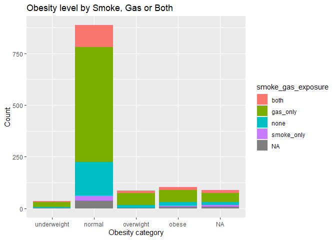
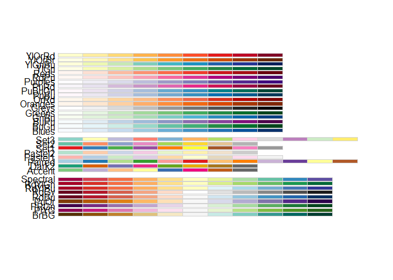

Assignment_02
================
Camille Parchment
2022-10-07

``` r
if (!file.exists("individual.csv"))
download.file("https://raw.githubusercontent.com/USCbiostats/data-science-data/master/01_chs/chs_individual.csv", "individual.csv", method="libcurl", timeout = 60)
```

``` r
indv <- read.csv("individual.csv")
```

``` r
if (!file.exists("regional.csv"))
download.file("https://raw.githubusercontent.com/USCbiostats/data-science-data/master/01_chs/chs_regional.csv", "regional.csv", method="libcurl", timeout = 60)
```

``` r
reg <- read.csv("regional.csv")
```

### Merge data

``` r
chs <- merge(indv, reg, by="townname")
```

``` r
nrow(chs)
```

    ## [1] 1200

After merging based on location (townname) there are still 1200
observations in our data set.

``` r
library(tidytext)
library(tidyverse)
```

    ## ── Attaching packages ─────────────────────────────────────── tidyverse 1.3.2 ──
    ## ✔ ggplot2 3.3.6     ✔ purrr   0.3.4
    ## ✔ tibble  3.1.8     ✔ dplyr   1.0.9
    ## ✔ tidyr   1.2.0     ✔ stringr 1.4.1
    ## ✔ readr   2.1.2     ✔ forcats 0.5.2
    ## ── Conflicts ────────────────────────────────────────── tidyverse_conflicts() ──
    ## ✖ dplyr::filter() masks stats::filter()
    ## ✖ dplyr::lag()    masks stats::lag()

``` r
library(data.table)
```

    ## 
    ## Attaching package: 'data.table'
    ## 
    ## The following objects are masked from 'package:dplyr':
    ## 
    ##     between, first, last
    ## 
    ## The following object is masked from 'package:purrr':
    ## 
    ##     transpose

``` r
library(dplyr)
library(ggplot2)
```

``` r
chs <- as_tibble(chs)
```

``` r
library(dtplyr)
```

### Impute data using the average within the variables “male” and “hispanic.”

``` r
chs[, bmi_imp = fcoalesce(bmi, mean(bmi, na.rm = TRUE)),
by = .(male,hispanic)]
```

    ## # A tibble: 1,200 × 49
    ##    townname   sid  male race  hispanic agepft height weight   bmi asthma activ…¹
    ##    <chr>    <int> <int> <chr>    <int>  <dbl>  <int>  <int> <dbl>  <int>   <int>
    ##  1 Alpine     841     1 W            1  10.5     150     78  15.8      0       0
    ##  2 Alpine     835     0 W            0  10.1     143     69  15.3      0       0
    ##  3 Alpine     838     0 O            1   9.49    133     62  15.9      0       0
    ##  4 Alpine     840     0 W            0   9.97    146     78  16.6      0       0
    ##  5 Alpine     865     0 W            0  10.0     162    140  24.2      1       1
    ##  6 Alpine     867     0 W            1   9.96    141     94  21.5      0       0
    ##  7 Alpine     842     1 M            1   9.49    139     65  15.3      0       0
    ##  8 Alpine     839     0 M            1  10.1     142     86  19.4      0       0
    ##  9 Alpine     844     1 W            1  10.5     143     65  14.4     NA       0
    ## 10 Alpine     847     1 M            0   9.90    137     69  16.7      0       0
    ## # … with 1,190 more rows, 38 more variables: father_asthma <int>,
    ## #   mother_asthma <int>, wheeze <int>, hayfever <int>, allergy <int>,
    ## #   educ_parent <int>, smoke <int>, pets <int>, gasstove <int>, fev <dbl>,
    ## #   fvc <dbl>, mmef <dbl>, pm25_mass <dbl>, pm25_so4 <dbl>, pm25_no3 <dbl>,
    ## #   pm25_nh4 <dbl>, pm25_oc <dbl>, pm25_ec <dbl>, pm25_om <dbl>, pm10_oc <dbl>,
    ## #   pm10_ec <dbl>, pm10_tc <dbl>, formic <dbl>, acetic <dbl>, hcl <dbl>,
    ## #   hno3 <dbl>, o3_max <dbl>, o3106 <dbl>, o3_24 <dbl>, no2 <dbl>, …

### Create a BMI catergorical variable and a summary table with underweight, normal weight, overweight, and obese.

``` r
obesity_level <- cut(chs$bmi, breaks=c(0, 14, 22, 24, 100), labels= c("underweight","normal", "overwight","obese"), right = FALSE)
```

``` r
obesity_level[1:10]
```

    ##  [1] normal normal normal normal obese  normal normal normal normal normal
    ## Levels: underweight normal overwight obese

``` r
chs$bmi[1:10]
```

    ##  [1] 15.75758 15.33749 15.93183 16.63283 24.24797 21.49151 15.29189 19.38649
    ##  [9] 14.44836 16.71034

``` r
summary(obesity_level) 
```

    ## underweight      normal   overwight       obese        NA's 
    ##          35         886          87         103          89

``` r
summary(chs$bmi, na.rm = TRUE)
```

    ##    Min. 1st Qu.  Median    Mean 3rd Qu.    Max.    NA's 
    ##   11.30   15.78   17.48   18.50   20.35   41.27      89

``` r
smoke_gas_exposure <- ifelse(chs$smoke == 0 & chs$gasstove == 0 , "none",
                                            ifelse(chs$smoke == 1 & chs$gasstove == 0, "smoke_only",
                                            ifelse(chs$smoke == 0 & chs$gasstove == 1, "gas_only",
                                            ifelse(chs$smoke == 1 & chs$gasstove == 1, "both", NA))))
                                            table(smoke_gas_exposure, useNA = "always")
```

    ## smoke_gas_exposure
    ##       both   gas_only       none smoke_only       <NA> 
    ##        151        739        214         36         60

``` r
library(data.table)
```

``` r
chs <- data.table(chs)
```

### 4 tables gouped by town, sex, obesity_level, and smoke gas exposure

``` r
town_averages <- chs[, .(
    fev_avg      = mean(fev, na.rm=TRUE),
    asthma_avg   = mean(asthma, na.rm=TRUE)),
    by = townname
    ][order(townname)] %>% head(n=10)
```

``` r
sex_averages <- chs[, .(
    fev_avg      = mean(fev, na.rm=TRUE),
    asthma_avg   = mean(asthma, na.rm=TRUE)),
    by = male
    ][order(male)] %>% head(n=10)
```

``` r
Obs_averages <- chs[, .(
    fev_avg      = mean(fev, na.rm=TRUE),
    asthma_avg   = mean(asthma, na.rm=TRUE)),
    by = obesity_level
    ][order(obesity_level)] 
```

``` r
head(town_averages)
```

    ##         townname  fev_avg asthma_avg
    ## 1:        Alpine 2089.014  0.1134021
    ## 2:    Atascadero 2079.374  0.2551020
    ## 3: Lake Elsinore 2039.787  0.1263158
    ## 4:  Lake Gregory 2091.665  0.1515152
    ## 5:     Lancaster 2002.550  0.1649485
    ## 6:        Lompoc 2038.227  0.1134021

``` r
head(sex_averages)
```

    ##    male  fev_avg asthma_avg
    ## 1:    0 1959.105  0.1208054
    ## 2:    1 2103.819  0.1727749

``` r
head(Obs_averages)
```

    ##    obesity_level  fev_avg asthma_avg
    ## 1:   underweight 1686.800 0.08571429
    ## 2:        normal 1997.974 0.14104046
    ## 3:     overwight 2224.322 0.16470588
    ## 4:         obese 2269.295 0.21000000
    ## 5:          <NA>      NaN 0.13095238

### Part 2

### facet plot of BMI and FEV by townname

``` r
ggplot(chs, aes(x= bmi, y= fev, color= townname)) + geom_point() + facet_wrap(~ townname, ncol = 4)
```

    ## Warning: Removed 95 rows containing missing values (geom_point).

<!-- -->

``` r
ggplot(chs, aes(x= obesity_level, fill= smoke_gas_exposure )) +geom_bar()
```

<!-- -->

``` r
ggplot(chs, aes(x= obesity_level, y= fev))+ geom_boxplot()
```

    ## Warning: Removed 95 rows containing non-finite values (stat_boxplot).

<!-- -->

``` r
ggplot(chs, aes(x=smoke_gas_exposure, y= fev )) + geom_boxplot()
```

    ## Warning: Removed 95 rows containing non-finite values (stat_boxplot).

<!-- -->

``` r
library(leaflet)
```

``` r
pm2.pal <- colorNumeric(c('darkgreen','goldenrod','brown'), domain=chs$pm25_mass)
```

``` r
pm25_avg <- chs[, .(
    pm25_mass    = mean(pm25_mass, na.rm=TRUE)),
    by = townname
    ][order(townname)] 
```

``` r
ggplot(chs, aes(x= pm25_mass, y= fev )) +geom_boxplot()
```

    ## Warning: Continuous x aesthetic -- did you forget aes(group=...)?

    ## Warning: Removed 95 rows containing non-finite values (stat_boxplot).

<!-- -->
