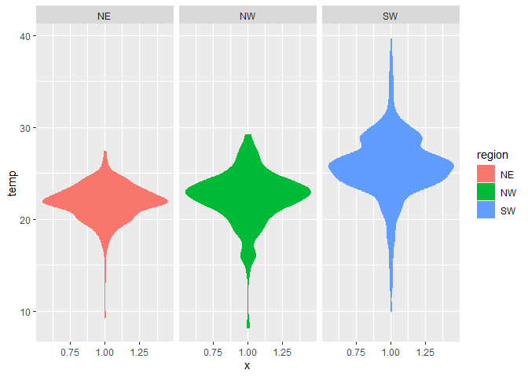

Lab 03
================
CP
2022-09-15

## Read in the data

First download and then read in with data.table:fread()

``` r
if (!file.exists("../lab03/met_all.gz"))
download.file("https://raw.githubusercontent.com/USCbiostats/data-science-data/master/02_met/met_all.gz", "met_all.gz", method="libcurl", timeout = 60)
```

``` r
met <- data.table::fread("../lab4/met_all.gz")
```

``` r
library(tidyverse)
```

    ## ── Attaching packages ─────────────────────────────────────── tidyverse 1.3.2 ──
    ## ✔ ggplot2 3.3.6     ✔ purrr   0.3.4
    ## ✔ tibble  3.1.8     ✔ dplyr   1.0.9
    ## ✔ tidyr   1.2.0     ✔ stringr 1.4.1
    ## ✔ readr   2.1.2     ✔ forcats 0.5.2
    ## ── Conflicts ────────────────────────────────────────── tidyverse_conflicts() ──
    ## ✖ dplyr::filter() masks stats::filter()
    ## ✖ dplyr::lag()    masks stats::lag()

``` r
library(lubridate)
```

    ## 
    ## Attaching package: 'lubridate'
    ## 
    ## The following objects are masked from 'package:base':
    ## 
    ##     date, intersect, setdiff, union

``` r
library(data.table)
```

    ## 
    ## Attaching package: 'data.table'
    ## 
    ## The following objects are masked from 'package:lubridate':
    ## 
    ##     hour, isoweek, mday, minute, month, quarter, second, wday, week,
    ##     yday, year
    ## 
    ## The following objects are masked from 'package:dplyr':
    ## 
    ##     between, first, last
    ## 
    ## The following object is masked from 'package:purrr':
    ## 
    ##     transpose

## Step 2 Prep data

Remove temperatures less than -17C and change elev 9999 to missing value

``` r
met <- met[temp > -17][elev ==9999.0, elev:=NA]
```

``` r
summary(met$elev)
```

    ##    Min. 1st Qu.  Median    Mean 3rd Qu.    Max.    NA's 
    ##   -13.0   101.0   252.0   414.3   400.0  4113.0     182

Generate a date variable

``` r
met <- met[, ymd := as.Date(paste(year, month, day, sep = "-"))]
```

Using the data.table::week function, keep the observations of the first
week of the month.

``` r
met[, table(week(ymd))]
```

    ## 
    ##     31     32     33     34     35 
    ## 297259 521600 527922 523847 446576

``` r
met <-met[week(ymd)==31]
```

Compute the mean by station of the variables temp, rh, wind.sp,
vis.dist, dew.point, lat, lon, and elev.

``` r
met[,.(
  temp     = max(temp,na.rm=TRUE),
  rh       = max(rh,na.rm=TRUE),
  wind.sp  = max(wind.sp,na.rm=TRUE),
  vis.dist = max(vis.dist,na.rm=TRUE),
  lat      = max(lat ,na.rm=TRUE),
  lon      = max(lon ,na.rm=TRUE), 
  elev     = max(elev,na.rm=TRUE)
)]
```

    ##    temp  rh wind.sp vis.dist    lat     lon elev
    ## 1:   47 100    20.6   144841 48.941 -68.313 4113

Great! No more 9999s in our dataset.

``` r
met_avg <- met[,.(
  temp     = mean(temp,na.rm=TRUE),
  rh       = mean(rh,na.rm=TRUE),
  wind.sp  = mean(wind.sp,na.rm=TRUE),
  vis.dist = mean(vis.dist,na.rm=TRUE),
  dew.point= mean(dew.point, na.rm=TRUE),
  lat      = mean(lat),
  lon      = mean(lon), 
  elev     = mean(elev,na.rm=TRUE)
), by=c("USAFID")]
```

Create a region variable for NW, SW, NE, SE based on lon = -93. 8.00 and
lat = 39.71 degrees

``` r
met_avg[, region := 
                fifelse(lon >=-98 & lat > 39.71, "NE",
                fifelse(lon <-98 & lat > 39.71, "NW",
                fifelse(lon <-98 & lat <= 39.71, "SW","SE")))]

 table(met_avg$region)                     
```

    ## 
    ##  NE  NW  SW 
    ## 484 146 945

Create a categorical variable for elevation as in the lecture slides

``` r
met_avg[, elev_cat := fifelse(elev > 252, "high", "low")]
```

## 3. MAke Violin plots of dew point temp by region

``` r
met_avg[!is.na(region)] %>% 
  ggplot() + 
  geom_violin(mapping = aes(y =temp, x = 1, color=region, fill=region)) + 
  facet_wrap(~ region, nrow = 1)
```

<!-- -->

``` r
met_avg[, region := 
                fifelse(lon >=-98 & lat > 39.71, "NE",
                fifelse(lon <-98 & lat > 39.71, "NW",
                fifelse(lon <-98 & lat <= 39.71, "SW","SE")))]

 table(met_avg$region)
```

    ## 
    ##  NE  NW  SW 
    ## 484 146 945

``` r
met_avg[!is.na(region)] %>% 
  ggplot() + 
  geom_violin(mapping = aes(y =dew.point, x = 1, color=region, fill=region)) + 
  facet_wrap(~ region, nrow = 1)
```

<!-- --> the
highest dew point temperatures recorded in the south west.

``` r
met_avg[!is.na(region) & !is.na(wind.sp)] %>% 
  ggplot() + 
  geom_violin(mapping = aes(y =wind.sp, x = 1, color=region, fill=region)) + 
  facet_wrap(~ region, nrow = 1)
```

<!-- --> the highest
wind speed occured in the Northeast

\##4. Use geom_point and geom_smooth to examine the association between
dew point temperature and wind speed by region

``` r
met_avg[!is.na(region) & !is.na(wind.sp)] %>% 
  ggplot(mapping = aes(x =wind.sp, y = dew.point, color=region,)) + 
  geom_point() + 
  geom_smooth(method = lm, mapping = aes(linetype = region, color ="black"))+
  facet_wrap(~ region, nrow = 1)
```

    ## `geom_smooth()` using formula 'y ~ x'

<!-- -->
Southwest is the only plot decreasing.

\##5. Use geom_bar to creat bar plots of the weather stations by
elevation category

``` r
met_avg %>%
filter(!(region %in% NA)) %>% 
  ggplot(mapping = aes(x = elev)) + 
  geom_bar(position="dodge")
```

<!-- -->

    ## 6. Use stat_summary to examine mean dew point and wind speed by region with standard deviation error bars


    ```r
    met_avg[!is.na(dew.point)] %>%
      ggplot (mapping = aes(x = region, y = dew.point))

<!-- -->

``` r
    stat_summary(fun.data= mean_sdl)
```

    ## geom_pointrange: na.rm = FALSE, orientation = NA
    ## stat_summary: fun.data = function (x, ...) 
    ## {
    ##     check_installed("Hmisc")
    ##     fun <- getExportedValue("Hmisc", fun)
    ##     result <- do.call(fun, list(x = quote(x), ...))
    ##     rename(new_data_frame(as.list(result)), c(Median = "y", Mean = "y", Lower = "ymin", Upper = "ymax"))
    ## }, fun = NULL, fun.max = NULL, fun.min = NULL, fun.args = list(), na.rm = FALSE, orientation = NA
    ## position_identity
