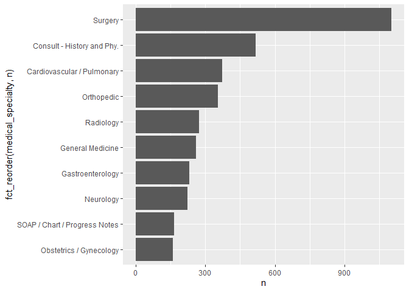

Lab 06
================
CP
2022-09-28

## Read in the data

First download and then read in with data.table:fread()

``` r
if (!file.exists("mtsamples.csv"))
download.file("https://raw.githubusercontent.com/USCbiostats/data-science-data/master/00_mtsamples/mtsamples.csv", "mtsamples.csv", method="libcurl", timeout = 60)
```

``` r
mts <- read.csv("mtsamples.csv")
```

``` r
library(tidytext)
library(tidyverse)
```

    ## ── Attaching packages ─────────────────────────────────────── tidyverse 1.3.2 ──
    ## ✔ ggplot2 3.3.6     ✔ purrr   0.3.4
    ## ✔ tibble  3.1.8     ✔ dplyr   1.0.9
    ## ✔ tidyr   1.2.0     ✔ stringr 1.4.1
    ## ✔ readr   2.1.2     ✔ forcats 0.5.2
    ## ── Conflicts ────────────────────────────────────────── tidyverse_conflicts() ──
    ## ✖ dplyr::filter() masks stats::filter()
    ## ✖ dplyr::lag()    masks stats::lag()

``` r
library(data.table)
```

    ## 
    ## Attaching package: 'data.table'
    ## 
    ## The following objects are masked from 'package:dplyr':
    ## 
    ##     between, first, last
    ## 
    ## The following object is masked from 'package:purrr':
    ## 
    ##     transpose

``` r
library(dplyr)
library(ggplot2)
library(forcats)
```

``` r
str(mts)
```

    ## 'data.frame':    4999 obs. of  6 variables:
    ##  $ X                : int  0 1 2 3 4 5 6 7 8 9 ...
    ##  $ description      : chr  " A 23-year-old white female presents with complaint of allergies." " Consult for laparoscopic gastric bypass." " Consult for laparoscopic gastric bypass." " 2-D M-Mode. Doppler.  " ...
    ##  $ medical_specialty: chr  " Allergy / Immunology" " Bariatrics" " Bariatrics" " Cardiovascular / Pulmonary" ...
    ##  $ sample_name      : chr  " Allergic Rhinitis " " Laparoscopic Gastric Bypass Consult - 2 " " Laparoscopic Gastric Bypass Consult - 1 " " 2-D Echocardiogram - 1 " ...
    ##  $ transcription    : chr  "SUBJECTIVE:,  This 23-year-old white female presents with complaint of allergies.  She used to have allergies w"| __truncated__ "PAST MEDICAL HISTORY:, He has difficulty climbing stairs, difficulty with airline seats, tying shoes, used to p"| __truncated__ "HISTORY OF PRESENT ILLNESS: , I have seen ABC today.  He is a very pleasant gentleman who is 42 years old, 344 "| __truncated__ "2-D M-MODE: , ,1.  Left atrial enlargement with left atrial diameter of 4.7 cm.,2.  Normal size right and left "| __truncated__ ...
    ##  $ keywords         : chr  "allergy / immunology, allergic rhinitis, allergies, asthma, nasal sprays, rhinitis, nasal, erythematous, allegr"| __truncated__ "bariatrics, laparoscopic gastric bypass, weight loss programs, gastric bypass, atkin's diet, weight watcher's, "| __truncated__ "bariatrics, laparoscopic gastric bypass, heart attacks, body weight, pulmonary embolism, potential complication"| __truncated__ "cardiovascular / pulmonary, 2-d m-mode, doppler, aortic valve, atrial enlargement, diastolic function, ejection"| __truncated__ ...

``` r
mts <- as_tibble(mts)
```

\###Question 1: What specialties do we have? We can use count() from
dplyr to figure out how many different catagories do we have? Are these
catagories related? overlapping? evenly distributed?

``` r
specialties <-mts %>% count(medical_specialty) 
specialties %>% arrange(desc(n))
```

    ## # A tibble: 40 × 2
    ##    medical_specialty                    n
    ##    <chr>                            <int>
    ##  1 " Surgery"                        1103
    ##  2 " Consult - History and Phy."      516
    ##  3 " Cardiovascular / Pulmonary"      372
    ##  4 " Orthopedic"                      355
    ##  5 " Radiology"                       273
    ##  6 " General Medicine"                259
    ##  7 " Gastroenterology"                230
    ##  8 " Neurology"                       223
    ##  9 " SOAP / Chart / Progress Notes"   166
    ## 10 " Obstetrics / Gynecology"         160
    ## # … with 30 more rows

``` r
specialties %>%
  top_n(10) %>%
  ggplot(aes(x = n , y = fct_reorder(medical_specialty, n))) + geom_col()
```

    ## Selecting by n

<!-- --> \###Question
2 and 3 removal of stop words Tokenize the the words in the
transcription column Count the number of times each token appears
Visualize the top 20 most frequent words

``` r
mts %>%
  unnest_tokens(word, transcription) %>%
  anti_join(stop_words, by = c("word")) %>%
  count(word, sort = TRUE) %>%
  top_n(20, n) %>%
  ggplot(aes(n, fct_reorder(word, n))) +
  geom_col()
```

<!-- --> There are
many stop words, not specific to medical procedure. Patient is the most
frequently used word

### Question 3

Bonus points if you remove numbers as well
